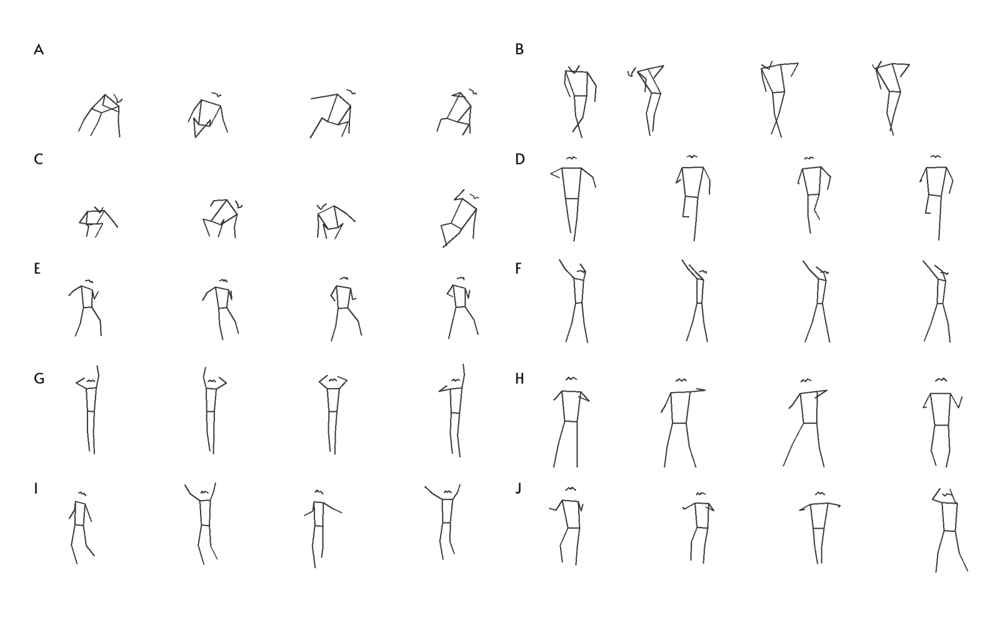

## Video Tokneization

Codebase for video tokenization, based on our paper [Towards Tokenized Human Dynamics Representation](https://arxiv.org/pdf/2111.11433.pdf).



### Prerequisites (tested under Python 3.8 and CUDA 11.1)

```console
apt-get install ffmpeg  
pip install torch==1.8  
pip install torchvision  
pip install pytorch-lightning  
pip install pytorch-lightning-bolts  
pip install aniposelib wandb gym test-tube ffmpeg-python matplotlib easydict scikit-learn   
```

### Data Preparation

1. Make a directory besides this repo and name it `aistplusplus`
2. Download from [AIST++ website](https://google.github.io/aistplusplus_dataset/download.html) until it looks like
```angular2html
├── annotations
│   ├── cameras
│   ├── ignore_list.txt
│   ├── keypoints2d
│   ├── keypoints3d
│   ├── motions
│   └── splits
└── video_list.txt
```

### How to run

1. Write one configuration file, e.g., `configs/tan.yaml`.
   
2. Run `python pretrain.py --cfg configs/tan.yaml` with GPU, which will create a folder under `logs` for this run. Folder name specified by the `NAME` in configuration file. Then run `python cluster.py --cfg configs/tan.yaml` (CPU-only) and check results in `demo.ipynb`.

3. Or you can download and unzip my training result into `logs` folder from [here](https://drive.google.com/file/d/1a40_wDAY_LsUZq9VYlx2qI7nRN--eDm6/view?usp=sharing). 
